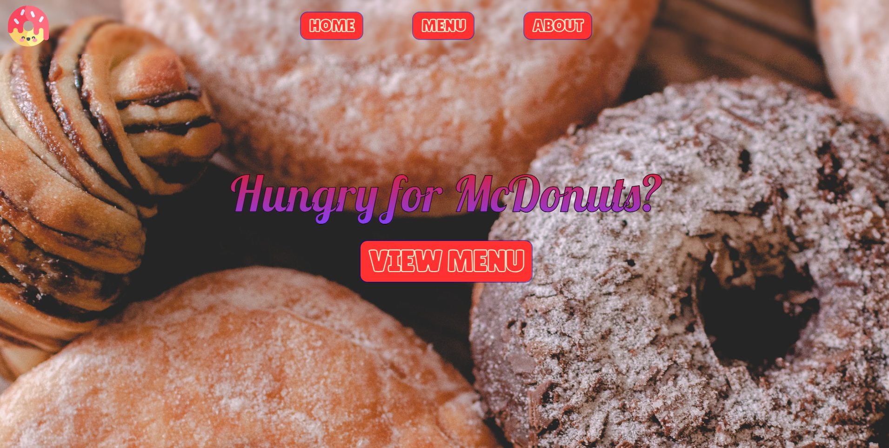
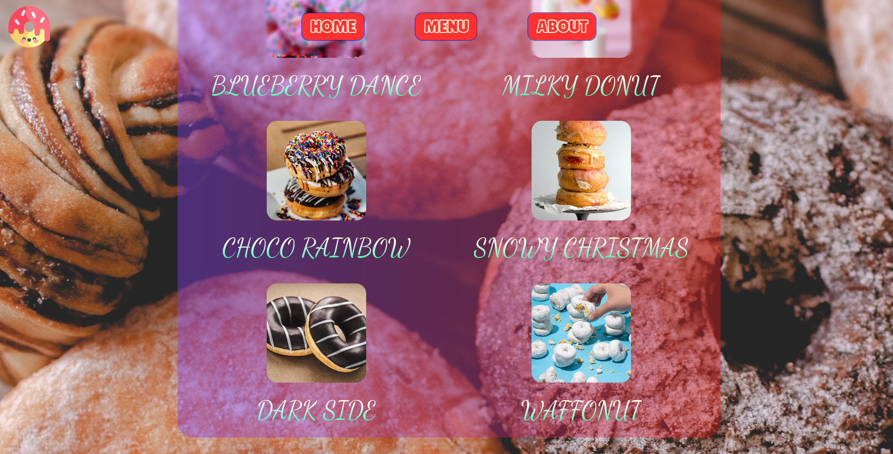
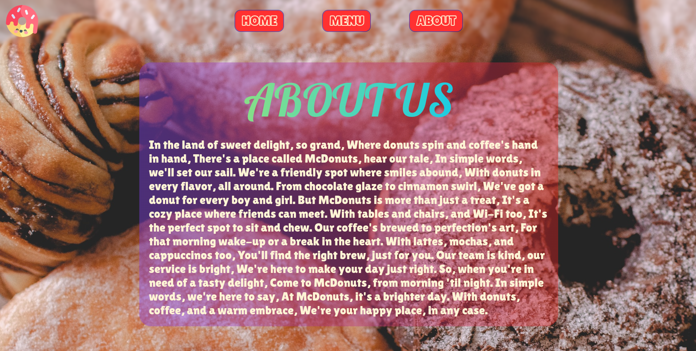

## McDonuts

McDonuts is a restaurant-page made with Webpack, Javascript, CSS and HTML.

## Deployment

Available live at: https://charbytesdev.github.io/mcDonuts

## Features

- [x] Uses tabbed browsing to access pages.
- [x] Utilizes various webpack features to improve performance.
- [x] Creates page solely using DOM manipulation.

 

 
 

## Built With

- [Webpack](https://webpack.js.org/)
  Module bundler
- [HTML](https://developer.mozilla.org/en-US/docs/Web/HTML) - Hyper Text Markup Language
- [CSS](https://developer.mozilla.org/en-US/docs/Web/CSS) - Cascading Style Sheets
- [JS](https://developer.mozilla.org/en-US/docs/Web/JavaScript) - Programming Language
